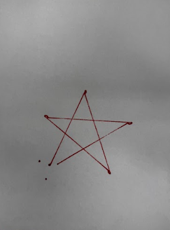

# Final Project: Finch Robot Challenges

## Essential Question
How can we apply object-oriented programming principles and Java concepts to create interactive, autonomous robot behaviors that solve real-world challenges?

## Project Overview
In this project-based learning experience, you will program a Finch 2.0 robot to perform one of three challenges:
1. Choreograph a dance routine (with movement, lights, and sound)
2. Create an artistic drawing using the robot's movements
3. Navigate a maze autonomously

Your program must demonstrate your understanding of Java programming concepts from APCSA and object-oriented design principles while creating an engaging robot behavior.

## Learning Objectives
- Apply Java programming concepts in a physical computing context
- Implement object-oriented design principles
- Develop problem-solving skills through algorithm development
- Create well-documented and maintainable code
- Practice technical communication through presentations and documentation

## Description of design choices
For my Finch final project, I chose to do the drawing challenge. I programmed the Finch 2.0 robot to draw a five-pointed star using forward movements and sharp turns. To make it more engaging, I added LED flashes at every turning point, giving the robot a more interactive and visual feel while it draws.

I designed the movement using a combination of setWheelVelocities() and sleep() to control both the distance and the angles. Since a five-pointed star requires turning approximately 144 degrees between each point, I used timed turns to create this angle. I kept the Finch’s speed consistent to ensure smooth lines, and I tested different timing values until the drawing came out balanced.

## Challenges faced and solutions
One of the biggest challenges I faced was getting the angles and distances right. The Finch robot doesn’t know angles like “144°” out of the box, so I had to simulate turning using timed wheel speeds. At first, the star shape came out uneven, and the points didn’t connect properly.

To fix this, I tested how long the Finch needed to turn at specific speeds and adjusted the timing in small increments until the star looked symmetrical. 

I also had problems with the LED flashing. At first, the headlight only flashed at the very beginning of the drawing and didn’t show up at the other turns. With help from Mr. Aiello, we figured out that the LED code needed to be placed inside a reusable method. After creating a separate function to handle both the turn and LED flash, it worked consistently for all five points of the star.

## Future enhancements
If I had more time, I would improve the project by:

- **Add unique sounds for each turn**  
  Each time the Finch makes a turn, it could play a different tone. With this, the robot’s actions would be more expressive and easier to follow during the drawing.

- **Allow the user to select the shape or style**  
  Using keyboard input or a simple text-based menu, the user could choose whether the Finch draws a star, square, or triangle. This would make the project more flexible.

- **Changing the LED color at each point**  
  The Finch’s LED could display a different color every time it draws a new line segment. For example: red at point 1, green at point 2, blue at point 3, and so on. This would make the drawing more visually interesting.

## Video or images of your robot in action (embedded or linked)
Link to Video: https://youtube.com/shorts/Oj8m5PFu4Jg?feature=share

Image Produced by Finch Robot:

